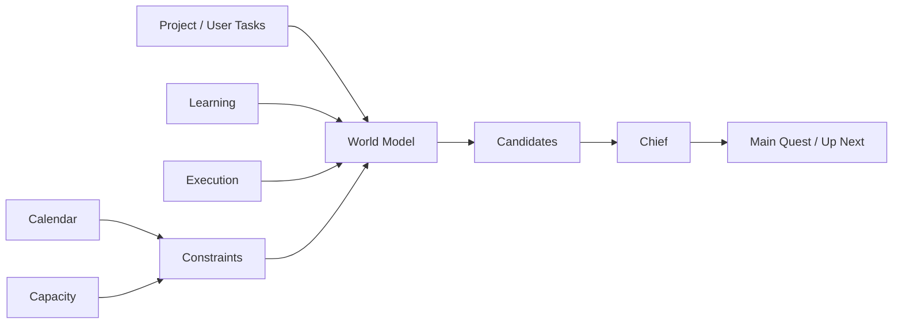

# Task-first, Time-aware Planning

## Problem

현재 계획은 시간 배치의 영향이 커서, 예상보다 빨리 끝내거나 늦어지는 실제 생활의 변화를 자연스럽게 처리하기 어렵다.

## Decision

> **Task-first, Time-aware.**

나는 시간을 계획의 기준 단위로 두지 않고,
완료해야 할 Task를 기준으로 계획한다.

시간은 Calendar, Capacity, Deadline을 통해
Task의 실행 가능성과 우선순위를 판단하는 제약조건으로 사용한다.

## Why

- 실제 실행시간은 예상과 자주 달라진다.
- 작은 변동마다 전체 시간표를 다시 짜고 싶지 않다.
- 나는 "몇 시에 할지"보다 "무엇을 끝내야 하는지"를 중심으로 관리하고 싶다.
- Task 상태 중심 구조가 이후 Replan에도 더 안정적이다.

## Trade-off

정교한 자동 시간표 생성을 P0의 우선순위에서 낮추고,
다음에 끝내야 할 Task를 정확히 결정하는 것을 우선한다.

## Architecture

