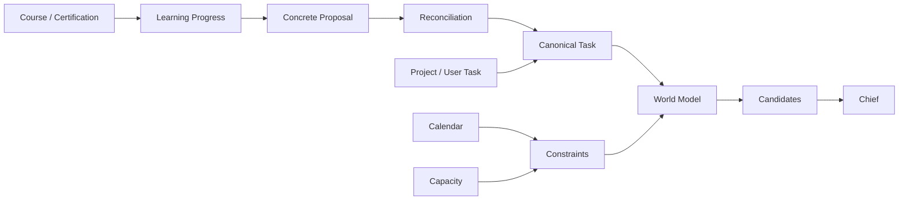

# Learning Work as Canonical Task

## Problem

Learning이 실행할 행동을 구체화하고도 실제 Task가 되기 전에
Chief Candidate로 전달되면서 World Model과 Chief가 서로 다른
현재 상태를 볼 수 있었다.

## Decision

> Learning에서 실행 가능한 행동이 확정되면
> Chief 판단 전에 canonical Task로 materialize한다.

Course, Certification, Project, User Task 모두
Chief 앞에서는 같은 Task 실행 모델을 사용한다.

## Why

- Project와 Learning을 동일한 실행 모델로 관리한다.
- DONE / PARTIAL / SKIP과 실제 소요시간을 같은 방식으로 추적한다.
- World Model을 현재 현실의 일관된 Snapshot으로 유지한다.
- Chief는 Task 생성이 아니라 Task 선택에 집중한다.

## Trade-off

Learning Task가 더 일찍 DB에 생성되지만,
Task 생성과 우선순위 판단의 책임이 분리된다.

미래 학습 범위를 한꺼번에 생성하지 않고
각 Material의 다음 실행 가능한 Task만 유지한다.

## Architecture

