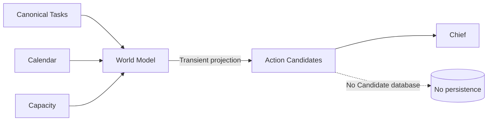

# Candidate as Task Projection

## Problem

Canonical Task와 Chief 사이에 별도의 Candidate 상태를 저장하면
같은 일을 Task와 Candidate 두 곳에서 관리하게 되고,
현재 현실의 Source of Truth가 다시 분리될 수 있다.

## Decision

> Candidate는 별도의 저장 상태가 아니라
> canonical Task에서 파생되는 일시적인 판단용 Projection으로 둔다.

World Model의 현재 Task 중 실행 가능한 Task만
동일한 ActionCandidate 형태로 정규화한다.

Project, User, Course, Certification은
Chief 앞에서 같은 Candidate 계약을 사용한다.

## Why

- canonical Task를 단일 Source of Truth로 유지한다.
- Candidate 상태 중복과 동기화 문제를 만들지 않는다.
- Project와 Learning을 같은 판단 입력으로 처리한다.
- Candidate 생성과 Chief 우선순위 판단의 책임을 분리한다.

## Trade-off

Candidate 자체의 장기 상태나 순위를 저장하지 않는다.

매 판단 시점마다 최신 World Model에서 다시 생성하므로
계산은 반복되지만 현재 현실과 항상 일치하는 쪽을 우선한다.

## Architecture

