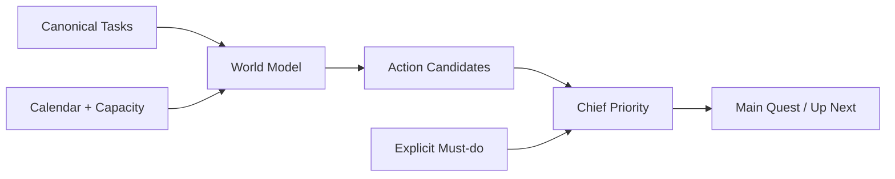

# Chief Owns Priority

## Problem

Task, World Model, Candidate가 각각 우선순위를 결정하면
같은 현실에 대해 여러 개의 우선순위 규칙이 생기고
사용자가 왜 이 일을 먼저 해야 하는지 설명하기 어려워진다.

## Decision

> Task는 사실을 보유하고,
> World Model은 현재 현실을 구성하며,
> Candidate는 실행 가능한 Task를 정규화하고,
> Chief만 최종 우선순위를 결정한다.

P0 Chief는 불투명한 weighted score 대신
명시적인 계층형 정책을 사용한다.

Priority precedence:

1. Explicit Must-do
2. Deadline danger
3. Deadline × remaining workload × future capacity
4. Commitment
5. Strategic importance
6. Today feasibility
7. Task importance
8. Stable input order

## Why

- 사용자의 명시적 의도를 항상 보호한다.
- 가까운 마감뿐 아니라 미래 capacity 붕괴를 조기에 발견한다.
- 우선순위 결정 이유를 설명할 수 있다.
- Task와 Candidate에 최종 rank를 저장하지 않는다.
- 정책 변경 시 영향을 추적하기 쉽다.

## Trade-off

P0에서는 deterministic policy를 우선한다.

Task -> Goal alignment와
ambiguous natural-language priority interpretation은
신뢰할 수 있는 canonical evidence가 준비된 뒤 확장한다.

## Architecture

