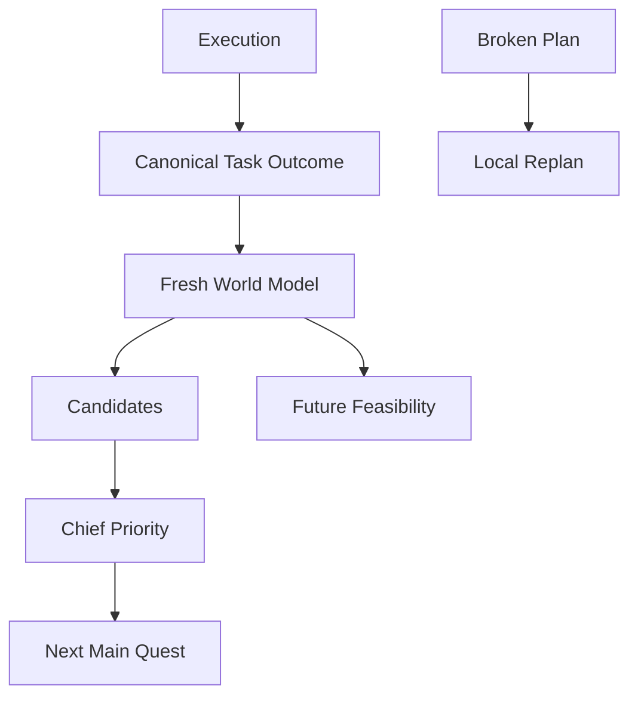

# Outcome Refresh Does Not Mean Reschedule

## Problem

Task를 완료할 때마다 남은 하루 계획 전체를 다시 배치하면 Task 완료라는 사실과 시간표 재작성이라는 판단이 결합된다.

특히 예상 60분 Task를 43분에 끝낸 경우, 완료 사실만 반영하면 충분한데 17분이 생겼다는 이유로 이후 일정까지 이동할 수 있다.

## Decision

> Outcome은 먼저 canonical reality를 갱신한다.
> 단순 완료/조기 완료는 자동 일정 재배치 사유가 아니다.

완료 후에는 fresh World Model과 Chief Priority를 통해 다음 Task와 미래 feasibility를 다시 판단한다.

Local Replan은 현재 계획이 실제로 깨지는 경우에만 유지한다.

P0 자동 Local Replan 사유:

- `task_overrun`
- `task_blocked`
- `task_switched`
- `manual_replan`

ordinary completion / early completion:

- no automatic plan reshuffle

## Why

- Task가 시간 슬롯보다 Source of Truth가 된다.
- 실제 완료시간을 존중한다.
- 불필요한 계획 변동을 줄인다.
- 사용자가 계획이 계속 흔들린다는 느낌을 받지 않는다.
- future feasibility는 새 현실에서 별도로 다시 계산한다.

## Architecture

