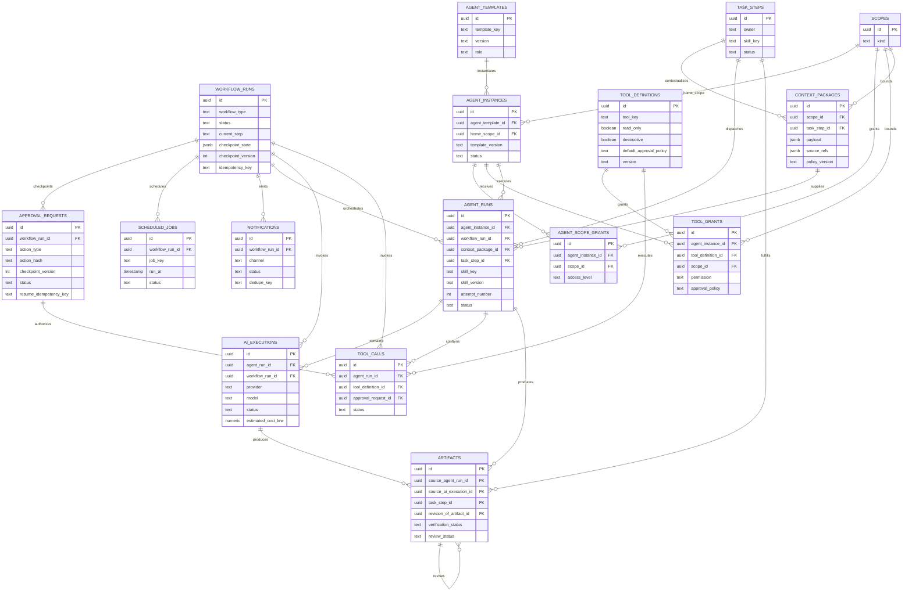

# Automation & Agent ERD

중단·재개 가능한 Workflow와 제한된 Agent 실행, Tool 권한, Artifact 생산 관계를 보여준다.

## 실행 계약

- Workflow는 checkpoint를 DB에 저장하고 process 종료 후 재개할 수 있다.
- Agent의 scope와 tool 권한은 prompt가 아니라 repository/tool layer에서 강제한다.
- `deny` 권한이 `allow`보다 우선한다.
- AgentRun은 실행 묶음, AIExecution은 model call, ToolCall은 capability 호출, Artifact는 재사용 결과다.
- 외부 write와 파괴적 작업은 ApprovalRequest를 통과한다.
- Artifact 수정은 덮어쓰기가 아니라 revision chain으로 남긴다.
