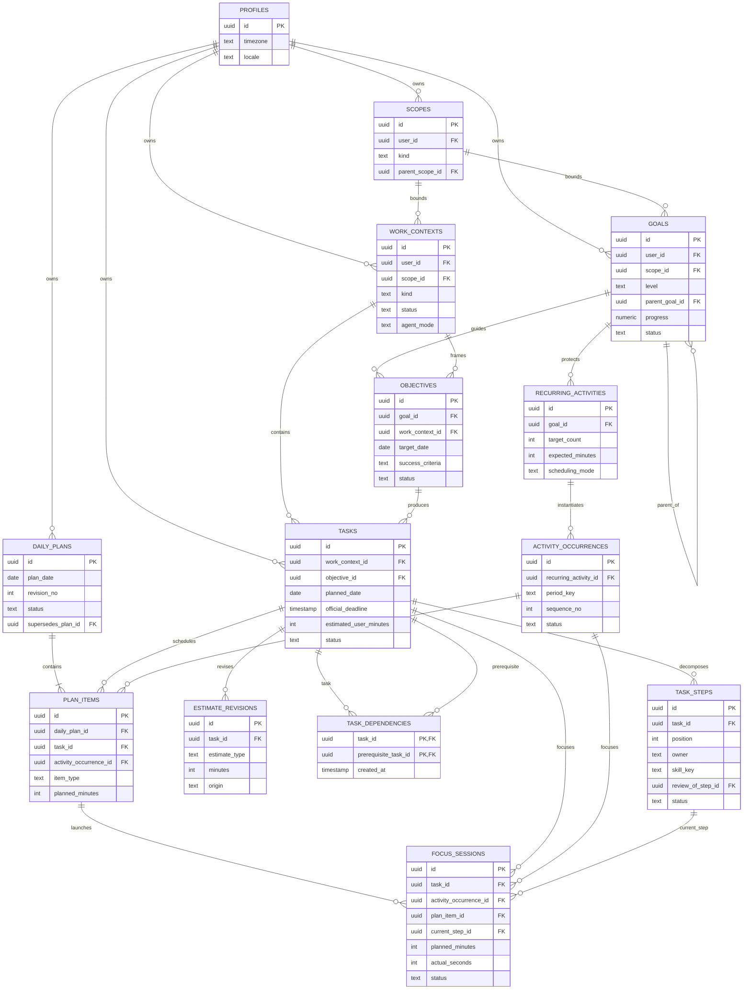

# Core Work & Planning ERD

`supabase/migrations/0001~0017` 기준의 핵심 업무·계획·실행 관계다. 가독성을 위해 운영에 직접 필요한 주요 column만 표시한다.

## 핵심 해석

- Goal은 방향, Objective는 완료조건이 있는 결과, Task는 실행할 일이다.
- Project와 Course는 `WorkContext`로 통합한다.
- Task의 Goal은 Objective를 통해 유도하며 `goal_id`를 중복 저장하지 않는다.
- 실행 소유권은 Task가 아니라 `TaskStep.owner=user|ai`에 둔다.
- DailyPlan은 revision 단위로 immutable하게 보존한다.
- FocusSession은 Task 또는 Routine occurrence 중 정확히 하나를 대상으로 한다.
