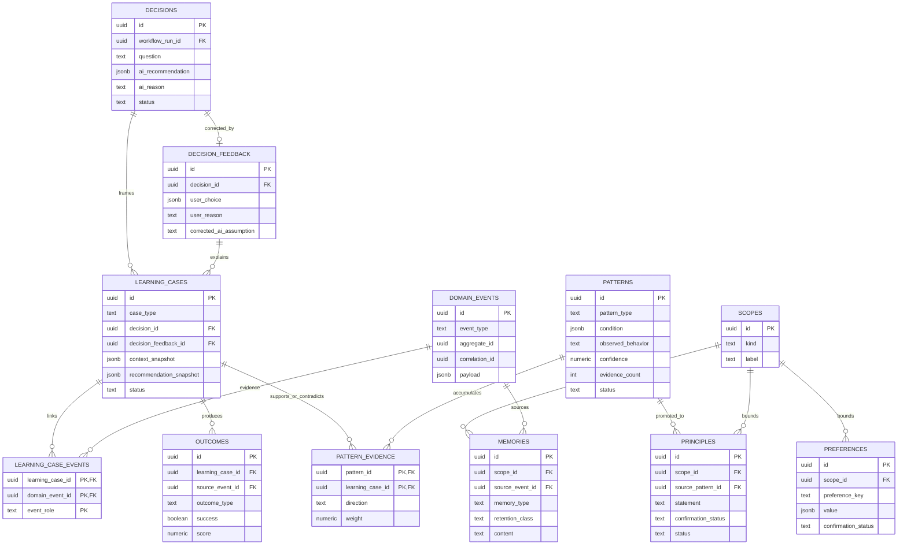

# Personalization & Clone ERD

사용자의 수정과 실제 결과가 검증 가능한 Pattern과 승인된 Principle로 발전하는 구조다.



## 학습 계약

```text
Context → Recommendation → User Choice/Reason → Action Event → Outcome
→ Pattern Evidence → Pattern Candidate → User Approval → Principle
```

- AI 요약문만으로 Pattern을 만들지 않는다.
- 한 번의 선택으로 사용자의 성향을 확정하지 않는다.
- Pattern 발견은 자동화할 수 있지만 Principle 적용은 사용자 승인이 필요하다.
- 현재 사용자 지시와 승인된 Desired behavior가 과거 Observed behavior보다 우선한다.
