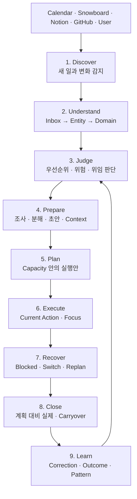

# Core Operating Loop

Amber HQ의 제품 가치는 입력이나 추천 한 번이 아니라 다음 루프가 끊기지 않고 닫힐 때 만들어진다.

## 단계별 canonical 결과

| 단계 | 주요 결과 |
|---|---|
| Discover | `InboxItem`, `ExternalReference` |
| Understand | `ParsedEntity`, `DomainCommand`, Domain entity |
| Judge | Chief priority, `Decision`, 이유와 근거 |
| Prepare | `TaskStep`, `ContextPackage`, `Artifact` |
| Plan | immutable `DailyPlan` revision, `PlanItem` |
| Execute | `FocusSession`, `DomainEvent` |
| Recover | intervention, 새 Plan revision |
| Close | carryover, `LearningCase`, `Outcome` |
| Learn | `PatternEvidence`, `Pattern`, 승인된 `Principle` |

## 불변 조건

- AI는 Parsed output을 만들 수 있지만 DB를 직접 mutation하지 않는다.
- 계획 변경은 기존 승인 Plan을 덮어쓰지 않고 새 revision을 만든다.
- 작은 변화는 Rule로 처리하고 큰 우선순위 변화만 승인받는다.
- 실행 결과가 다음 판단에 다시 들어와야 루프가 완료된다.
