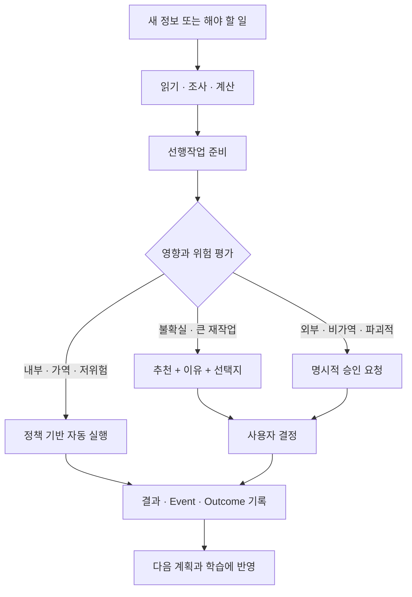

# Proactive Action & Approval Boundary

Amber가 먼저 행동하는 범위와 사용자 승인이 필요한 경계를 정의한다.

## 판단 매트릭스

| 영향 | 되돌리기 쉬움 | 되돌리기 어려움 |
|---|---|---|
| 낮음 | 자동 실행 | 짧은 확인 또는 정책 승인 |
| 높음 | 추천 후 필요 시 승인 | 반드시 명시적 승인 |

## Amber가 먼저 처리하는 대표 작업

- 연결 정보 읽기와 상태 동기화
- 마감·충돌·가용시간·Capacity 계산
- 요구사항 분석과 실행 Step 분해
- 공개 조사와 관련 자료 탐색
- 초안, 비교안, 체크리스트, Context Package 생성
- 보호 Goal을 훼손하지 않는 작은 계획 이동
- 승인된 AI-owned TaskStep 실행과 검증 가능한 Artifact 생성

## 사용자 판단이 필요한 대표 작업

- 큰 우선순위와 프로젝트 핵심 방향
- 보호 Goal 또는 개인시간을 포기하는 변경
- 중요한 범위·품질·마감 위험 변경
- 외부 메시지, 제출, 삭제, production 반영
- Agent 권한 확대
- Pattern을 장기 Principle로 승격

핵심은 승인의 수를 늘리는 것이 아니라 **결정 비용과 Tool 위험이 큰 지점에만 승인을 배치하는 것**이다.
