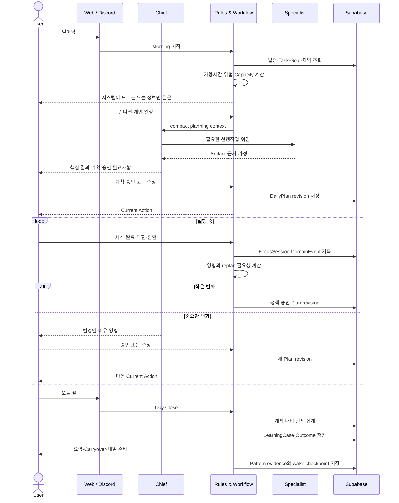

# Daily Operating Sequence

Morning부터 Day Close까지 사용자, Chief, deterministic Core, Specialist, DB가 협력하는 순서다.

## 사용자가 직접 하지 않는 일

- 하루의 완료·미완료를 다시 설명하기
- 예상시간과 실제시간을 수동 합산하기
- 모든 일정 충돌을 직접 계산하기
- 작은 지연마다 전체 계획을 다시 짜기
- Specialist에게 프로젝트 맥락을 반복 전달하기

## 사용자가 계속 소유하는 일

- 큰 우선순위와 방향
- 중요한 변경의 승인
- 최종 결과 검토와 외부 제출
- 장기 Principle 승인
