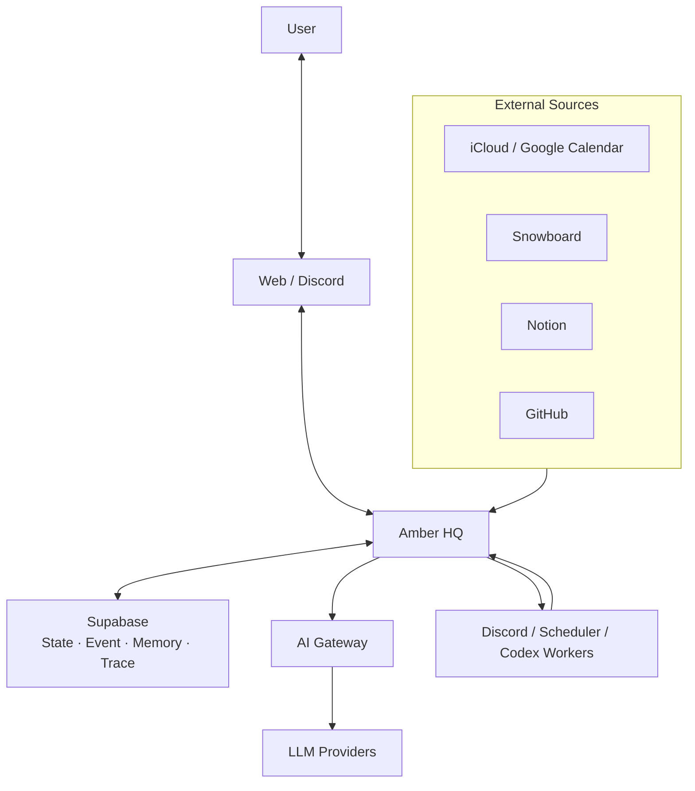

# System Context

Amber HQ와 사용자, 외부 Source, AI 실행 환경의 경계를 보여준다.

## 경계 원칙

- Supabase가 Amber 내부 상태의 Source of Truth다.
- 고정 일정은 해당 외부 Calendar가 원본을 소유한다.
- Notion은 지식 저장소이며 Task Runtime DB가 아니다.
- GitHub는 Source code와 개발 상태의 원본이다.
- 모든 AI 호출은 AI Gateway를 통과한다.
- 외부 연결은 Adapter 뒤에 두며 제품 정책을 판단하지 않는다.
- Web과 Discord는 같은 Core Domain과 Workflow를 사용한다.
