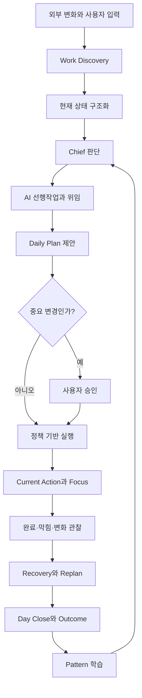
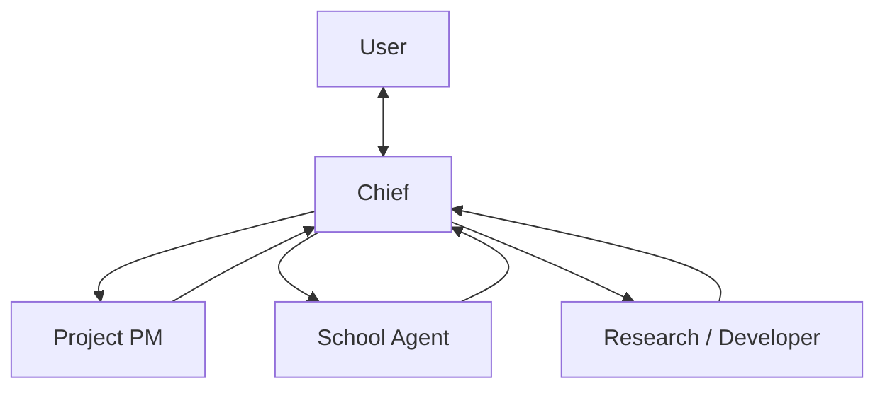

# Amber HQ Product Vision

**Status:** Product north star  
**Product:** Lifehacker / Amber HQ  
**Purpose:** 최종적으로 만들 서비스와 모든 기능 판단의 기준을 정의한다.

## 1. 한 문장 정의

> **Amber HQ는 사용자의 일정, 학업, 프로젝트, 생활과 장기 목표를 지속적으로 관찰하고, 필요한 일을 먼저 발견·준비·실행한 뒤, 중요한 판단만 사용자에게 요청하는 개인용 AI Chief of Staff다.**

사용자가 모든 일을 기억하고 계획하도록 돕는 도구가 아니다. 시스템이 복잡성을 대신 처리하여 사용자는 **지금 해야 할 행동과 본인만 내릴 수 있는 결정**에 집중하게 만드는 개인 운영체제다.

## 2. 해결하려는 문제

기존 Calendar, Todo, Notion은 대체로 사용자가 이미 다음을 알고 있다고 가정한다.

- 무엇이 새로 생겼는가
- 무엇이 중요한가
- 언제 해야 하는가
- 어떤 순서로 해야 하는가
- 무엇을 AI에게 맡길 수 있는가
- 계획이 틀어졌을 때 무엇을 바꿔야 하는가
- 다음에도 같은 판단을 어떻게 반복하지 않을 것인가

실제 부담은 Task를 입력하는 행위보다 이 판단과 확인을 반복하는 데서 생긴다. Amber HQ는 이 **판단 비용, 준비 비용, 복구 비용**을 가져간다.

## 3. 최상위 제품 원칙

> **사용자가 더 많은 일을 하게 만드는 것이 아니라, 중요한 일을 하면서 더 적은 것을 생각하게 만든다.**

이를 위해 Amber HQ는 다음 순서로 행동한다.

```text
알아볼 수 있는 것은 먼저 알아본다
→ 현재 상태를 구조화한다
→ 코드로 계산 가능한 것은 계산한다
→ AI가 미리 할 수 있는 일은 먼저 처리한다
→ 중요한 판단만 압축해 요청한다
→ 지금 할 행동 하나를 제시한다
→ 실행과 변화를 관찰한다
→ 계획을 현실에 맞게 복구한다
→ 수정 이유와 결과에서 학습한다
```

## 4. 제품의 본질

Amber HQ는 Task Manager보다 **Decision & Execution Manager**에 가깝다.

| 일반 생산성 도구 | Amber HQ |
|---|---|
| 사용자가 일을 입력함 | 연결된 Source에서 일을 발견함 |
| 사용자가 우선순위를 정함 | Chief가 근거와 제약을 바탕으로 우선순위를 제안함 |
| 사용자가 작업 준비를 함 | AI가 조사·정리·초안 등 선행작업을 수행함 |
| 계획을 보여줌 | 현재 행동 하나와 완료 기준을 제시함 |
| 일정이 틀어지면 사용자가 다시 계획함 | 실제 변화에 따라 남은 하루를 복구함 |
| 설정과 기록을 저장함 | 판단 수정 이유와 실행 결과를 학습함 |

## 5. 선제형 개인 비서 계약

Amber HQ의 기본값은 `질문 후 행동`이 아니라 **`확인 → 준비 → 필요한 경우 승인 → 행동`**이다.

### 5.1 묻기 전에 수행할 것

- Calendar, Task, Deadline, Project context 확인
- 연결된 문서와 기존 Decision 검색
- 공개적으로 확인 가능한 정보 조사
- 요구사항 분석과 Task 분해
- 예상시간, 가용시간, 충돌, 마감 위험 계산
- AI가 담당할 단계와 사용자가 담당할 단계 분리
- 자료 수집, 비교안, 초안, Context Package 준비
- 현재 정보로 가능한 합리적 가설 수립

### 5.2 자동화 수준

| 수준 | Amber의 행동 | 예시 |
|---|---|---|
| 관찰 | 자동 수행 | 일정·과제·변경 감지, 상태 동기화 |
| 계산 | 자동 수행 | D-Day, 가용시간, 충돌, Capacity, 단순 재배치 |
| 준비 | 자동 수행 | 요구사항 정리, 조사, Task 분해, 초안 생성 |
| 내부·가역 행동 | 정책 범위 안에서 자동 또는 사전 승인된 실행 | Task 후보 생성, 작은 계획 이동, Artifact 생성 |
| 중요 판단 | 추천과 이유를 압축해 승인 요청 | 큰 우선순위, Goal 보호 해제, 범위 변경 |
| 외부·비가역 행동 | 명시적 승인 후 실행 | 제출, 메시지 발송, 삭제, production 반영 |

자동화의 목표는 사용자를 배제하는 것이 아니다. **Human in every loop가 아니라 Human at important loops**를 구현하는 것이다.

## 6. 핵심 운영 루프



상세: [Operating Loop](./diagrams/operating-loop.md)

## 7. Chief의 책임

Chief는 사용자-facing 단일 책임자다.

| 책임 | 결과 |
|---|---|
| 관찰 | 일정, Task, Project, Goal의 최신 상태 |
| 판단 | 오늘 확보해야 할 결과와 미뤄도 되는 일 |
| 계획 | 실제 가용시간 안에서 가능한 Daily Plan |
| 위임 | 사용자와 AI의 TaskStep 소유권 분리 |
| 준비 | 사용자가 시작하기 전 필요한 자료와 초안 |
| 실행 지원 | 지금 할 행동 하나와 완료 기준 |
| 복구 | 지연, 막힘, 일정 변화 이후의 실행 가능 상태 |
| 결정 압축 | 사용자만 판단할 항목과 추천안 |
| 학습 | correction과 outcome에서 얻은 Pattern |

Chief의 대표 출력은 다음과 같다.

```text
TODAY PRIORITY  오늘 반드시 확보해야 하는 결과
FUTURE RELIEF   오늘 해두면 이후 부담을 실제로 줄이는 일
NOT TODAY       중요하지만 오늘은 하지 않을 일
WHY NOW         지금 이 순서인 근거
AI DELEGATION   Amber와 Specialist가 먼저 처리할 일
CURRENT ACTION  사용자가 지금 해야 하는 한 가지
```

## 8. 하루의 사용자 경험

### Morning

사용자가 `일어남`을 알리면 Amber는 Calendar, 미완료 Task, Deadline, Goal 진행도와 가용시간을 먼저 확인한다. 시스템이 알 수 없는 오늘의 제약만 묻고 계획을 제안한다.

### Execution

사용자는 전체 할 일 목록보다 `Current Action`을 먼저 본다. Task 시작 전 전체 흐름과 AI/User 역할을 확인하고, Focus 중에는 현재 Step 하나에 집중한다.

### Recovery

막히거나 계획이 틀어졌을 때 실패로 기록하고 끝내지 않는다. 원인을 분류하고, 필요한 개입을 제공하고, 남은 하루를 다시 완료 가능한 상태로 만든다.

### Day Close

시스템이 계획 대비 실제, 완료·미완료, Focus 시간, 막힘, 전환과 주요 결정을 수집한다. 사용자가 하루를 다시 설명하지 않아도 다음 날로 필요한 상태와 학습을 넘긴다.

## 9. Agent 운영 모델

Chief는 모든 일을 직접 하지 않는다. Project PM, School, Researcher, Developer 같은 Specialist를 제한된 범위에서 호출한다.



Agent는 별도 애플리케이션이 아니라 다음 Runtime configuration이다.

```text
Agent = Role + Instructions + Memory Scope + Tools + Permissions + Model Policy
```

Specialist는 필요한 Context Package만 받고 결과, 근거, 가정, Artifact와 필요한 결정만 Chief에게 반환한다. Chief가 이를 종합해 사용자에게 압축한다.

## 10. 개인화와 AI Clone

Amber Clone은 사용자의 행동을 그대로 흉내 내는 복제본이 아니다. **반복되는 유용한 판단 방식을 구조화하여 다음 판단 비용을 줄이는 개인화 계층**이다.

```text
상황
→ AI 추천
→ 사용자 선택과 수정 이유
→ 실제 행동
→ 결과
→ 반복 Evidence
→ Pattern Candidate
→ 사용자 승인
→ Principle
```

관찰된 행동과 사용자가 원하는 행동이 충돌하면 승인된 목표와 Principle을 우선한다. 미루는 습관을 관찰했다는 이유로 미루는 계획을 만들지 않는다.

## 11. UI의 역할

Home은 Dashboard가 아니라 **Command Center / Control Plane**이다.

2.5D Tycoon Office는 장식이 아니라 복잡한 운영 시스템을 이해하기 쉬운 공간 메타포로 바꾸는 인터페이스다.

- Main Quest: 지금 해야 할 행동 하나
- Next Quests: Chief가 추천한 다음 순서
- Today's Missions: 오늘의 핵심 결과 최대 3개
- Agent station: Specialist 상태와 기능 진입점
- Persistent Review: 사용자 판단이 필요한 항목

기본 질문은 `관리할 정보가 무엇이지?`가 아니라 **`그래서 지금 무엇을 하면 되지?`**다.

## 12. 제품 경계

Amber HQ는 다음을 하지 않는다.

- 모든 변화마다 알림을 보내지 않는다.
- 모든 계산에 LLM을 사용하지 않는다.
- 한 번의 행동을 영구 성향으로 저장하지 않는다.
- 사용자 검토 없이 중요한 외부 제출을 하지 않는다.
- 계획 준수 자체를 목표로 삼지 않는다.
- 여러 Agent가 제한 없이 서로 대화하게 하지 않는다.
- Dashboard를 새로운 인지부하로 만들지 않는다.
- 사용자의 휴식과 개인시간을 남는 시간으로 취급하지 않는다.

## 13. 성공 지표

기능 수보다 다음 변화가 중요하다.

- `오늘 뭐 해야 하지?`를 직접 계산하는 횟수 감소
- Calendar, Deadline, Project 상태를 확인하는 횟수 감소
- 같은 맥락을 AI에게 반복 설명하는 횟수 감소
- AI 선행작업으로 절약한 사용자 작업시간 증가
- 계획이 틀어진 뒤 실행 재개까지 걸리는 시간 감소
- 예상시간 정확도와 마감 안정성 개선
- 장기 Goal이 단기 마감 때문에 사라지는 빈도 감소
- Amber 추천의 사용자 수정률과 반복 오류 감소

## 14. 문서와 구현 판단 기준

새 기능을 검토할 때 다음 순서로 판단한다.

1. 사용자의 기억·확인·판단·준비 비용을 줄이는가?
2. Amber가 먼저 처리할 수 있는 일을 늘리는가?
3. 사용자가 중요한 방향의 통제권을 유지하는가?
4. 코드로 처리 가능한 것을 AI에 맡기지 않는가?
5. 실제 실행과 복구까지 이어지는가?
6. correction과 outcome에서 학습할 수 있는가?
7. 기존 Architecture와 Source of Truth를 지키는가?

상세 제품 정책은 `product-rules.md`, 기술 구조는 `architecture.md`, 화면 책임은 `product-ia.md`, 데이터 의미는 `domain-model.md`를 따른다.
